# Coursera: AI for Medical Course
Summarize, assignment (Jupyter notebook), labs (Jupyter Notebook) from the Coursera's AI for Medical Course.

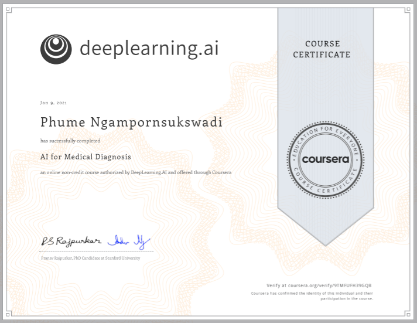

# Key Concepts

## Week 1: Summary

### Application of Computer Vision to Medical Diagnosis
- **Example 1 In Dermatology:** Using the CovNet to determine whether the region of skin tissue is cancer or not. Based on the following paper, the prediction from the model is as good as the prediction from the dermatologist. Reference: [Dermatologist-level classification of skin cancer with deep neural networks](https://www.nature.com/articles/nature21056)
  
  


- **Example 2 Ophthalmology (Eye Disease):** Given the *Retinal Fundus Photos* of an eyes, the model can be used to identify whether the patient has **Diabetic Retinopathy**, i.e. the damage cause by the diabetes which can lead blindness. Reference: [Fundus photograph-based deep learning algorithms in detecting diabetic retinopathy](https://www.nature.com/articles/s41433-018-0269-y)
  
  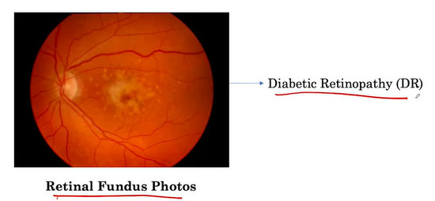

- **Eg 3 Histopathology (Cancer Diagnosis)**: Given a whole-slide image (microscopic tissue scan), determine whether the cancer has spread. Usually that the whole-slide images is very large, several patches are extracted and used to train the model, this is known as Data Augmentation techniques. Reference: [Impact of Deep Learning Assistance on the Histopathologic Review of Lymph Nodes for Metastatic Breast Cancer.](https://pubmed.ncbi.nlm.nih.gov/30312179/) 
  
  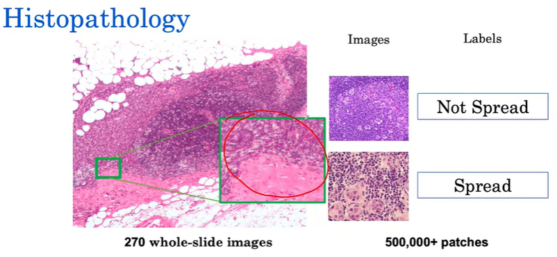

### Building and Training a Model for Medical Diagnosis
Objective: we want to build and train a model to detect the pneumonia, lung cancer, and other disease from the Chest X-ray. (Multi-Task Classification problem)
  - Example: Given an X-ray image, identify if there is a mass? (In medical field, a Mass is a lesion that is greater 3 cm. in diameter.)
   
    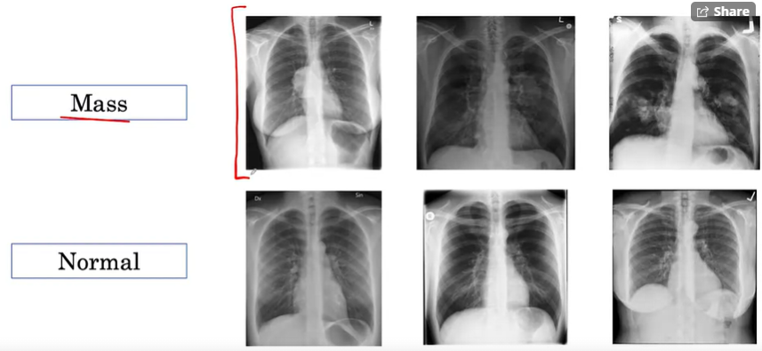

- 3 Key Challenges: Class imbalance, Multi-Task, Dataset Size
   
#### Challenge 1: Class Imbalance - More Normal example than Mass's example.
Imbalance problem is a very common problem in medical field. We usually have less sample from the anomaly/defect class. For example, the eye disease dataset, there are 30% of Diabetic Retinopathy and 70% of Non Diabetic Retinopathy. This yields a model that starts to predict a low probability of disease for everybody, if we are using the generic binary loss. 
  
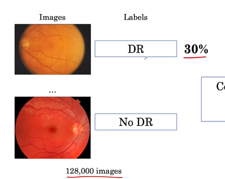


Consider the binary Cross-entropy loss,  
  $$  L(X,y) =
    \begin{cases}
      -log \ P(Y=1|X) & \text{if $y=1$}\\
      -log \ P(Y=0|X) = -log(1-P(Y=1|X)) & \text{if $y=0$}
    \end{cases}   $$
    
- The model's output is $\hat{P}(Y=1|X)$, i.e the probability of the image has a mass. 
- Example 1: Consider a Mass Image $(Y_i = 1, X_i)$ 
  - Assume it has the output of $P(Y_i=1|X_i)=0.2$
  - Then the loss is $L = -log(0.2) = 0.7$
- Example 2: Non-Mass Image $(Y_j = 0, X_j)$ 
  - Assume it has the output of $P(Y_j=1|X_j)=0.7$
  - Then, the loss is $L = -log(1-0.7) = 0.52$

Impact of Class Imbalance on Loss Calculation: we can see in the figure below that most of the contribution of the loss come from the normal class so the model will try to get the normal class right. 
  
  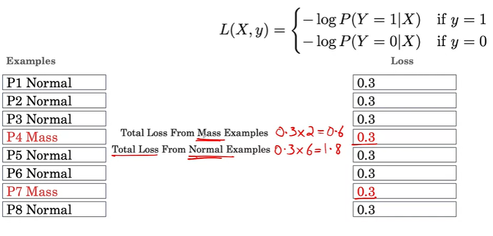 

**Solution 1**: `Weighted Loss` - modifying the loss function to make every classes have the same amount of contribution. 
  
  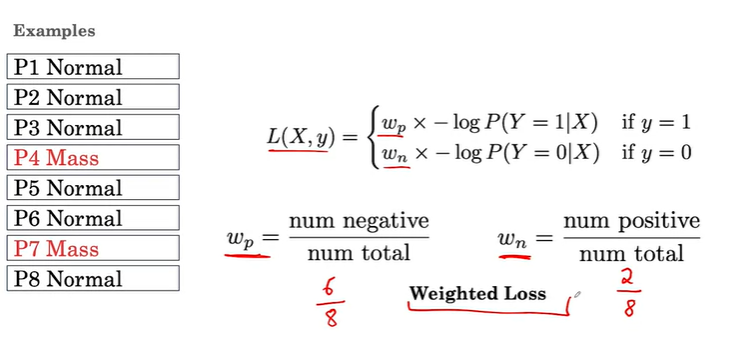 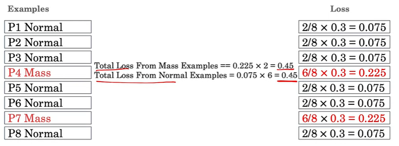

**Solution 2**: Resampling (Over-sampling / Under-sampling) the data such that we have the same number of observation for each class. Then, we can use standard binary cross-entropy loss.

#### Challenge 2: Multi-Task Classifier (A simplest case of multi-task learning)
Have model that can perform multiple task i.e. "Mass vs No-Mass", Pneumonia vs No-Pneumonia", "Edema vs No-Edema". The benefit of multi-task model is that each task might share information that could enable the model to generalize better on each original task. 

Assume we have 3 classification tasks, the output is a 3-dimensional vector. We are using the Weighted Multi-Label loss which is just the sum of the all individual loss. Note that, the weight of each loss are different for different label. 
  
  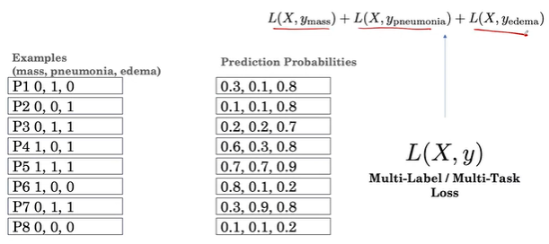
  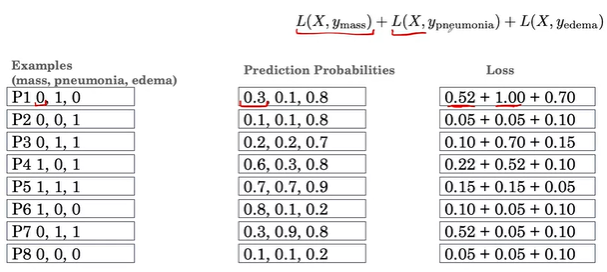
  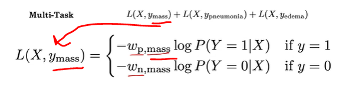


Addition resource on Multi-Task Learning: [An Overview of Multi-Task Learning in Deep Neural Networks (2017)](https://ruder.io/multi-task/)
  - Two method Hard parameter sharing and soft parameter sharing.
  - MTL in non-neural models: Linear / Bayesian / Kernel
  - MTL in DL: Fully-Adaptive Feature Sharing / Cross-stitch Networks / Low Supervision / Slice Network / ...


#### Challenge 3: Dataset Size - Medical image datasets typically have 10,000 to 100,000 examples.
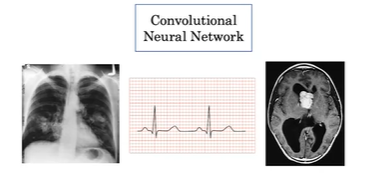

CNN is one of the most common method to analyze the medical Imaging problem, such as 2D X-ray, CT Scan, and medical Signal processing, but it is very data hungry. There are many CNN architecture. The standard procedure is to try them all and see which one works best. 
  
  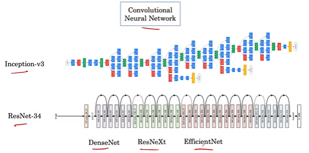

**Solution 1: Transfer Learning** Since we don't have a lot of data, we use **pre-trained** network and **fine-tune** it. The pre-trained network will learn the general feature that will help its learning on the medical task i.e. the feature that defines edges on penguin might be helpful for identify edges on the lung. There are 2 options in fine tuning: Fine tune all the layer and don't fine tune all the features (freeze the features learned by the shallow network and just fine tune the deeper layer).
  
  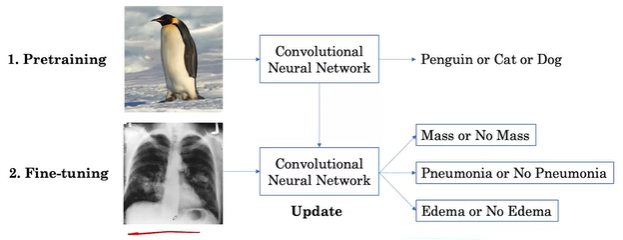
  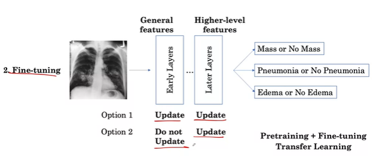

**Solution 2: Data Augmentation:** rotating / translating side way / zooming in / changing the brightness and contrast / adding the color noise 
  
  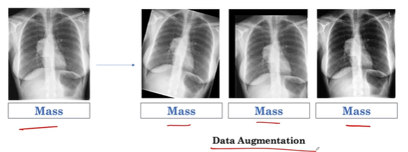 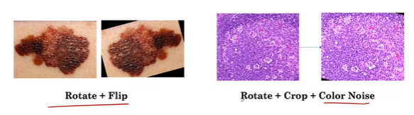

  In practice, 2 questions that drive the choice of the transformation: 
  - Do augmentation reflect the variation in real world?
   - Do augmentation keep the label the same? i.e. mirroring the chest x-ray would make the heart appear on the right which is not good. 


### Model Testing
**Splitting** the data (in this order) into testing set, validation set, and training set. The cross-validation is used to reduce the variability in the estimate of the model's performance. To prevent the model being overly-optimistic, the data must be split in such a way that they are all independent. For this example, a patient can have multiple scan. We must ensure that there is no patient overlap between these split. 
  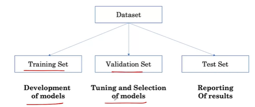
  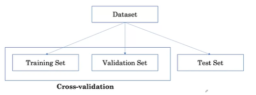 
  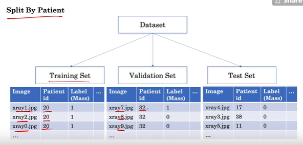


**Minority Sampling:** given that our data is imbalance, we might want to set a threshold number to ensure that the test set has at least X% of minority class (sometimes we set it to be 50%).


### Ground truth or Consensus Voting (in medical field)
- How do we determine the correct label of the sample?
- It is common in the medical field to have the inter-observer disagreement, i.e. two experts disagree on the label of the sample. 
  - We can use Consensus Voting i.e. the majority voting to help settle the disagreement. 
  
    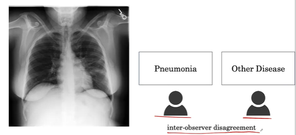

  - We can also use additional medical testing, e.g. using CT scan to confirm whether there is a mass in the chest x-ray. 
  
    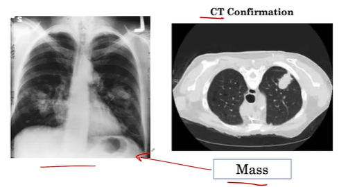


***
## Week 2: Summary

### Key Evaluation Metrics

Accuracy Metric:
$$Accuracy = \frac{\text{Sample Correctly Classified}}{\text{Total number of sample}}$$

**Relationship between Accuracy, Sensitivity, Specificity, and Prevalence**

We can define the accuracy in term of conditional probability: By interpreting the accuracy as the probability of being correct, i.e. $Accuracy = P(correct)$ 
  
  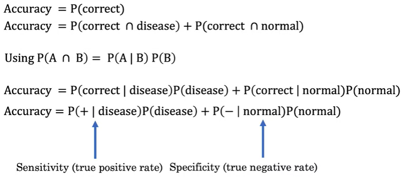


- Sensitivity / True Positive Rate / P(+|disease) : Given a patient has the disease, the probability that model predicts positive. Sensitivity tells us how good the model is at correctly identifying those patients who actually have the disease and label them as having the disease.
- Specificity / True Negative Rate / P(-|normal) : Given a patient is normal, the probability that the model predicts negative. Specificity tells us how good the model is at correctly identifying the healthy patients as not having the disease.
- Positive (+) = predicts disease
- Negative (-) = predicts normal

We can view the accuracy as the weighted average of sensitivity and specificity. 

  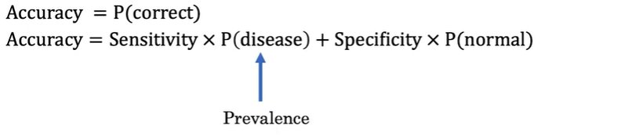
  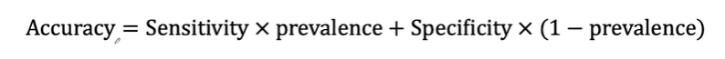

  
**Example: (negative = normal)**
  $$Sensitivity = P(+|disease) = \frac{\text{n(+ and disease)}}{\text{n(disease)}} = 2/3 = 0.67$$
  $$Specificity = P(-|normal) = \frac{\text{n(- and normal)}}{\text{n(normal)}} = 6/7 = 0.86$$
  $$Prevalence = P(disease)) = \frac{\text{n(disease)}}{\text{n(total)}} = 3/10 = 0.3$$
  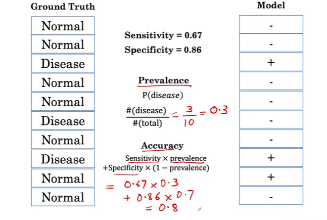


### PPV and NPV
- Positive predicted value (PPV), i.e. P( disease | + ). It is related to the concept of sensitivity. 
- Negative predicted value (NPV), i.e. P( normal | - ). It is related to the concept of specificity.

Example:
  $$PPV = P(pos|\hat{pos}) =  P(disease|+) = \frac{\text{n(+ and disease)}}{\text{n(+)}} = 2/3 $$
  $$NPV = P(neg|\hat{neg})= P(normal|-) = \frac{\text{n(- and normal)}}{\text{n(-)}} =  6/7 $$

### Confusion Matrix
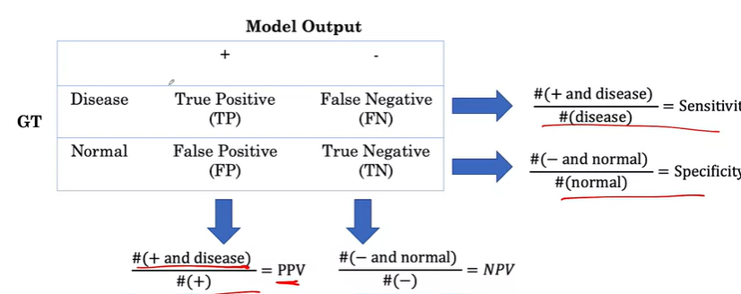
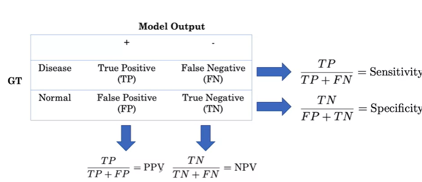

### ROC Curve and Threshold
- Threshold for the classification: we can set the threshold $t$ such that the predicted class $\hat{Y}=1(+) \text{ if } \hat{P}(Y=1|X) > t$
  - If $t=0$, we would classify everything to be positive which result in the sensitivity $P(+|disease+)$ being 1 and specificity = 0 P(-|normal-)
  - If $t=1$, it will be the opposite. 
- Varying the threshold:
  - Score: the output probability [0,1]
  - n = 15
  - Ground truth: red=disease+ and blue=normal-
  - If $score \gt t$, assign disease(+).
  - Example 1: 
    - Sensitivity = P(+|disease) = 6/7 = 0.85 
    - Specificity = P(-|normal) = 6/8 = 0.75
    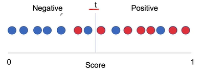
  - Example 2:
    - Sensitivity = P(+|disease) = 5/7 = 0.71
    - Specificity = P(-|normal) = 7/8 = 0.88
    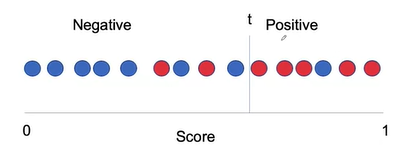

### Sampling from the total population
- Getting the performance of the model on the whole population is infeasible, i.e. getting the *population accuracy* (unknown) $p$ of the chest x-ray model based on all 50,000 patients in the hospital. 
- Using the small sample to get the estimated accuracy $\hat{p}$. We can obtain the 95% confidence interval of this estimated accuracy via repeated sample. In practice, we calculate the CI based on one sample. The larger sample size have a smaller CI. 
  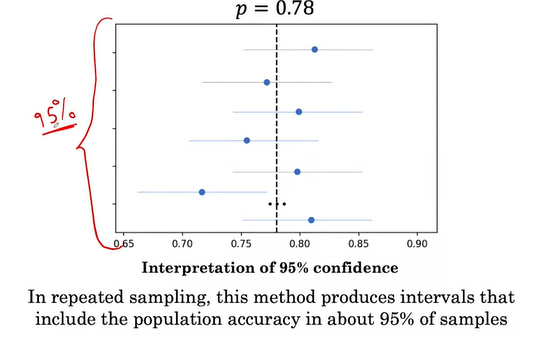


***
## Week 3: Summary

### MRI Lab
- See the Lab 3.1: exploring 3D MRI brain scans in the lab section

### MRI Data
- An MRI imaging sequence is a 3D volume. Each 2D image is called *slice*.
- A MRI sample consists of multiple imaging sequences (multiple 3D volumes).
    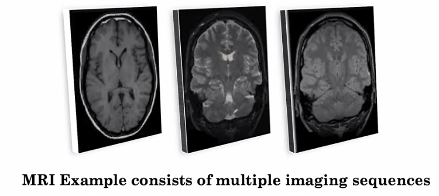
- Combine multiple 3D volumes into one 3D volume 
  - Treat each of the sequence as separate channels. There could be more or less than 3 sequences. 
  
    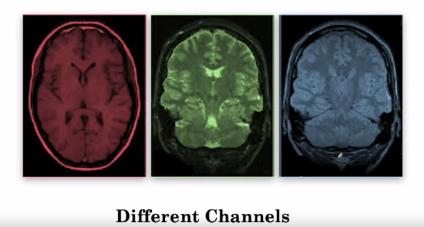
  
  - **Image Registration technique** can be used to ensure that the image are aligned with each others when all the channels are combined. 
  
    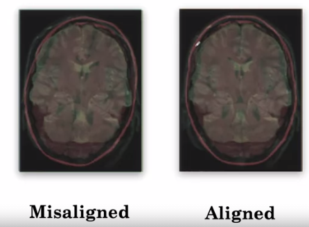

  - Combining multiple channels for all slices

    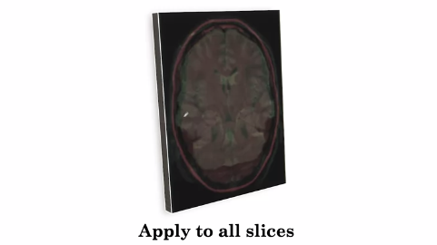

### Segmentation
- It is the process of finding the boundary of various tissue. Here, we are finding the boundary of the cancer. 
  - 2D Approach: we break up the 3D slices into multiple 2D slices. Each slides are passed through the segmentation and the result from each 2D slides are combined at the end. However, we might lose some information, i.e. cancer tissue usually covered by multiple 2D slides.
    
    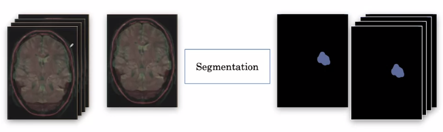

  - 3D Approach: It is impossible to pass the whole 3D sequences (not feasible). Instead, we break the whole 3D sequence into smaller 3D sub-volume then each of them is fed to the model (one at a time). This approach we lose the temporal context, i.e. if there is a cancer in a sub-volume, it is likely to be cancer around this sub-volume as well. 
  
    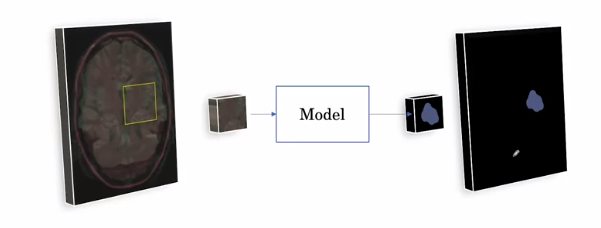

### 2D and 3D U-Net
- U-Net is one of the most popular Segmentation Architecture.
  - It can achieve good result even with 100 samples.
  - It consists of 2 parts: 
    - Contracting path: the feature map get smaller. It consists of repeating convolution (called down convolution) and pooling layers.
    - expanding path: it takes small features maps through series of up-sampling and up convolution layers to get back to the original size of the image. 
    - Output: the probability of being a tumor is assigned for each pixel.
  - The network is trained on the input/output pair of 2D slice. 
    
    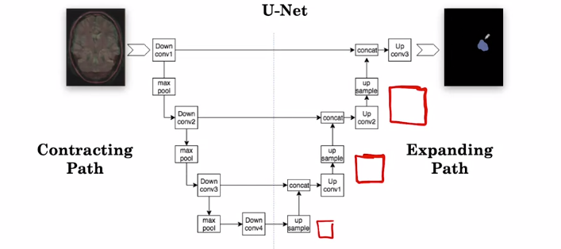
  
  - For 3D, just replace all the 2D layers with 3D, i.e. 2D Conv => 3D Conv, 2D pooling layer => 3D pooling layer. The input is a 3D sub-volume.

    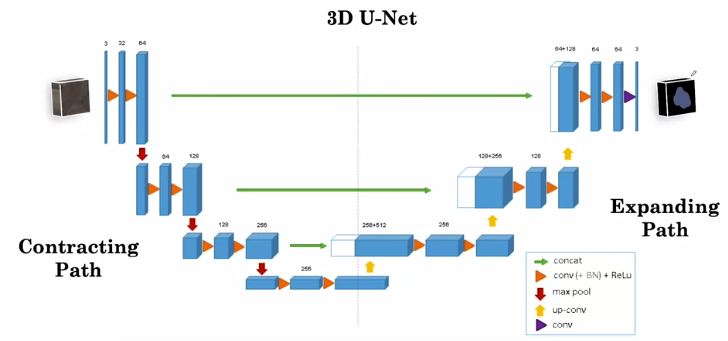

- Additional Information:
  - For a brief video introduction to U-Net by the original creators, Olaf Ronneberger, Philipp Fischer, Thomas Brox, please visit their site [U-Net: Convolutional Networks for Biomedical Image Segmentation](https://lmb.informatik.uni-freiburg.de/people/ronneber/u-net/).

If you would like more detail, start with this blog post by Heet Sankesara [“UNet”](https://towardsdatascience.com/u-net-b229b32b4a71).  

To go deeper, you can read the original research paper [U-Net: Convolutional Networks for Biomedical Image Segmentation](https://arxiv.org/pdf/1505.04597.pdf) by Olaf Ronneberger, Philipp Fischer, Thomas Brox


## Data Augmentation for Segmentation
- Unlike the data augmentation in 2D, in segmentation, the transformation need to apply to both input and output and it need to be apply on 3D. 

  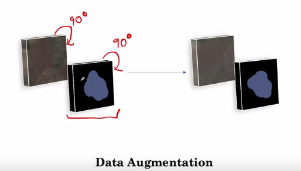

## Loss Function
- Example (in 2D), 
  - P = the output from the model where $p_i$ is the predicted probability of tumor in pixel ith.
  - G = ground truth (1:tumor, 0:normal)
  
  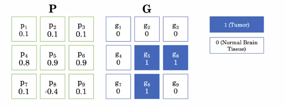

- Soft Dice Loss: it is very popular loss function for segmentation model and working well in the presence of the imbalance data which is usually the case for the segmentation problem, i.e. only a small fraction is a tumor region.
  - The fraction measure the overlap between the prediction and ground truth. We want this to be large.
    - Numerator is large when g=1, p should be large.  
    - Denominator is small when g=0, and p should be close to 0.
  - High loss $\equiv$ small overlap, Low loss $\equiv$ high overlap, 
  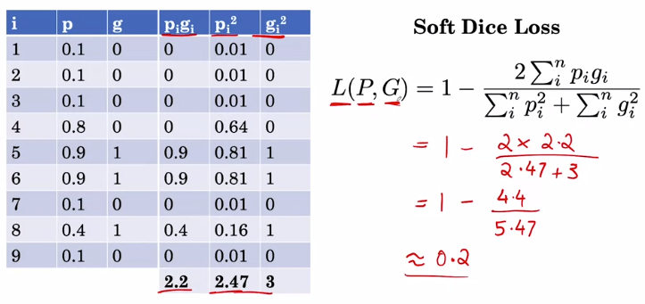

## Practical Consideration
- Generalization is hard.
  - Example 1: The model trained with US patient's data won't work with the patient from India.
  - Example 2: Resolution in brain MRI scan are much different across hospital. 

  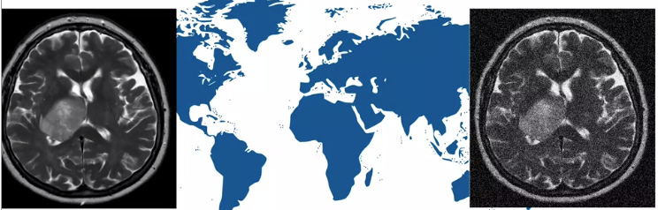

- External Validation: testing the model on the test sample from the new population. Note that the internal validation is drawn from the same population as the training and validation set. 

  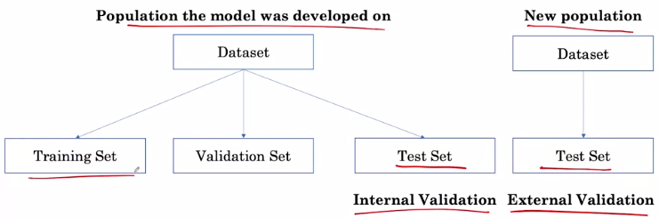

***
***

# Assignment

## Assignment 1
For this assignment, we will be using the [ChestX-ray8 dataset](https://arxiv.org/abs/1705.02315) which contains 108,948 frontal-view X-ray images of 32,717 unique patients. 
- Each image in the data set contains multiple text-mined labels identifying 14 different pathological conditions. 
- These in turn can be used by physicians to diagnose 8 different diseases. 
- We will use this data to develop a single model that will provide binary classification predictions for each of the 14 labeled pathologies. 
- In other words it will predict 'positive' or 'negative' for each of the pathologies.

The assignment will walk through some of the steps of building and evaluating this deep learning classifier model. In particular, you will:
- Pre-process and prepare a real-world X-ray dataset
- Use transfer learning to retrain a DenseNet model for X-ray image classification
- Learn a technique to handle class imbalance
- Measure diagnostic performance by computing the AUC (Area Under the Curve) for the ROC (Receiver Operating Characteristic) curve

### Key Processes:
- Checking Data Leakage.
  ```python
  df1_patients_unique = set(df1[patient_col].unique())
  df2_patients_unique = set(df2[patient_col].unique())
  
  patients_in_both_groups = df1_patients_unique.intersection(df2_patients_unique)
  ```

- Pre-processing the image:
  - Using Kera's `ImageDataGenerator`: Generate batches of tensor image data with real-time data augmentation.
  - Using generator for 
    - basic data augmentation (random horizontal flipping)
    - transform the values in each batch such that mean is zero and stdev is 1
    - Convery single channel X-ray image (gray-scale) to a three-channel inputs
    - normalize the incoming test data using the statistics computed from the training set (separate ImageDataGenerator).
- Loss function (Imbalance class)
  - The cross-entropy loss contribution from the $i^{th}$ training data case is: $$\mathcal{L}_{cross-entropy}(x_i) = -(y_i \log(f(x_i)) + (1-y_i) \log(1-f(x_i))),$$
  where 
    - $x_i$ and $y_i$ are the input features and the label, and 
    - $f(x_i)$ is the output of the model, i.e. the probability that it is positive
   
  - Note that for any training case, either $y_i=0$ or else $(1-y_i)=0$, so only one of these terms contributes to the loss (the other term is multiplied by zero, and becomes zero). 

  - We can rewrite the overall average cross-entropy loss over the entire training set $\mathcal{D}$ of size $N$ as follows: 

$$\mathcal{L}_{cross-entropy}(\mathcal{D}) = - \frac{1}{N}\big( \sum_{\text{positive class}} \log (f(x_i)) + \sum_{\text{negative class}} \log(1-f(x_i)) \big).$$

  - Weighted Loss
    $$\mathcal{L}_{cross-entropy}^{w}(x) = - (w_{p} y \log(f(x)) + w_{n}(1-y) \log( 1 - f(x) ) ).$$
    where $w_{pos} = freq_{neg}$ and $w_{neg} = freq_{pos}$
    so that $w_{pos} \times freq_{p} = w_{neg} \times freq_{n},$ where 
    $$freq_{p} = \frac{\text{number of positive examples}}{N} $$ 
    $$\text{and}$$
    $$freq_{n} = \frac{\text{number of negative examples}}{N}.$$

- DenseNet121: Using pre-trained DenseNet121
  ```python
  # create the base pre-trained model
  base_model = DenseNet121(weights='./nih/densenet.hdf5', include_top=False)

  x = base_model.output

  # add a global spatial average pooling layer
  x = GlobalAveragePooling2D()(x)

  # and a logistic layer
  predictions = Dense(len(labels), activation="sigmoid")(x)

  model = Model(inputs=base_model.input, outputs=predictions)
  model.compile(optimizer='adam', loss=get_weighted_loss(pos_weights, neg_weights))                       
  ```

- Fit the model
  ```python
  history = model.fit_generator(train_generator, 
                              validation_data=valid_generator,
                              steps_per_epoch=100, 
                              validation_steps=25, 
                              epochs = 3)

  plt.plot(history.history['loss'])
  plt.ylabel("loss")
  plt.xlabel("epoch")
  plt.title("Training Loss Curve")
  plt.show()
  ```
  - The model architecture for our pre-trained model is exactly the same, but we used a few useful Keras **`callbacks`** for this training. You can read about these callbacks and other useful Keras callbacks [here](https://keras.io/callbacks/). They are very useful for managing long-running training sessions:

    1. You can use `ModelCheckpoint` callback to monitor your model's `val_loss` metric and keep a snapshot of your model at the point. 
    2. You can use the `TensorBoard` to use the Tensorflow Tensorboard utility to monitor your runs in real-time. 
    3. You can use the `ReduceLROnPlateau` to slowly decay the learning rate for your model as it stops getting better on a metric such as `val_loss` to fine-tune the model in the final steps of training.
    4. You can use the `EarlyStopping` callback to stop the training job when your model stops getting better in it's validation loss. You can set a `patience` value which is the number of epochs the model does not improve after which the training is terminated. This callback can also conveniently restore the weights for the best metric at the end of training to your model.

- Visualizing learning with [GradCAM (2016)](https://arxiv.org/abs/1610.02391)
  - A GradCAM's technique to produce a heatmap highlighting the important regions in the image for predicting the pathological condition. This is done by extracting the gradients of each predicted class, flowing into our model's final convolutional layer.
  - It is worth mentioning that GradCAM does not provide a full explanation of the reasoning for each classification probability. However, it is still a useful tool for "debugging" our model and augmenting our prediction so that an expert could validate that a prediction is indeed due to the model focusing on the right regions of the image.
  
    ```python
    import cv2
    from keras import backend as K
    from tensorflow.compat.v1.logging import INFO, set_verbosity

    def grad_cam(input_model, image, cls, layer_name, H=320, W=320):
      """GradCAM method for visualizing input saliency."""
      y_c = input_model.output[0, cls]
      conv_output = input_model.get_layer(layer_name).output
      grads = K.gradients(y_c, conv_output)[0]

      gradient_function = K.function([input_model.input], [conv_output, grads])

      output, grads_val = gradient_function([image])
      output, grads_val = output[0, :], grads_val[0, :, :, :]

      weights = np.mean(grads_val, axis=(0, 1))
      cam = np.dot(output, weights)

      # Process CAM
      cam = cv2.resize(cam, (W, H), cv2.INTER_LINEAR)
      cam = np.maximum(cam, 0)
      cam = cam / cam.max()
      return cam
    ```
    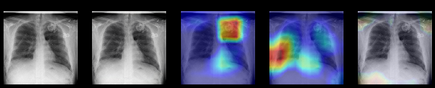
    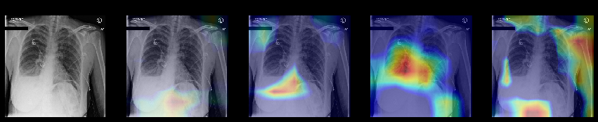


## Assignment 2: Evaluation of Diagnostic Models
- Topics: Accuracy, Prevalence, Specificity, Sensitivity, PPV & NPV, ROC, AUCROC, and confidence interval using the imbalance sample as an example. 

  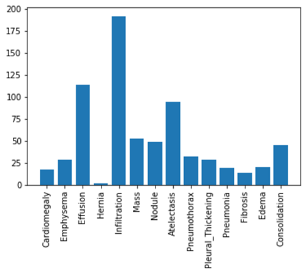

- True Positives, False Positives, True Negatives, and False Negatives: these metrics will depend on the choice of threshold, `thresholded_preds = pred >= threshold`
  - true positive (TP): Predict positive, and the actual label also positive. `TP = np.sum((y == 1) & (thresholded_preds == 1))`
  - false positive (FP): Predict positive, **but** the actual label is negative. `FP = np.sum((y == 0) & (thresholded_preds == 1))`
  - true negative (TN): Predict negative, and the actual label is also negative. `TN = np.sum((y == 0) & (thresholded_preds == 0))`
  - false negative (FN): Predict negative, **but** the label is actually positive. `FN = np.sum((y == 1) & (thresholded_preds == 0))`

- **Prevalence:** the proportion of positive examples. $$prevalence = \frac{1}{N} \sum_{i} y_i \text{    , where    } y_i = 1 \text{ when the obs. is positive (disease)}$$


- **Sensitivity and specificity** are used to evaluate how well the model predicts positives for patients with the condition and negatives for cases that actually do not have the condition.
  - Sensitivity is the probability that our test outputs positive given that the case is actually positive. Sensitivity only considers output on people in the positive class.
  - Specificity is the probability that the test outputs negative given that the case is actually negative. Specificity only considers output on people in the negative class.
  
  $$sensitivity = \frac{\text{true positives}}{\text{true positives} + \text{false negatives}}$$

  $$specificity = \frac{\text{true negatives}}{\text{true negatives} + \text{false positives}}$$

  - Positive predictive value (PPV) is the probability that subjects with a positive screening test truly have the disease.
  - Negative predictive value (NPV) is the probability that subjects with a negative screening test truly don't have the disease.

    $$PPV = \frac{\text{true positives}}{\text{true positives} + \text{false positives}}$$ 

    $$NPV = \frac{\text{true negatives}}{\text{true negatives} + \text{false negatives}}$$

- The Receiver Operating Characteristic (ROC) curve is created by plotting the true positive rate (TPR) against the false positive rate (FPR) at various threshold settings. The ideal point is at the top left, with a true positive rate of 1 and a false positive rate of 0. 

  - The area under the ROC curve is also called AUCROC or C-statistic and is a measure of goodness of fit. In medical literature this number also gives the probability that a randomly selected patient who experienced a condition had a higher risk score than a patient who had not experienced the event. This summarizes the model output across all thresholds, and provides a good sense of the discriminative power of a given model.
  
  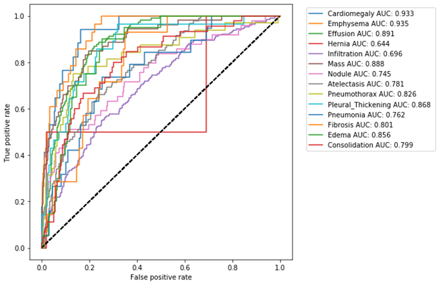

- Confidence Interval:
  - The bootstrap (stratified random sampling) method is used to estimates the uncertainty by resampling the dataset with replacement. 

- Precision-Recall is a useful measure of success of prediction when the classes are very imbalanced. 
  - Precision is a measure of result relevancy and that is equivalent to our previously defined PPV. 
  - Recall is a measure of how many truly relevant results are returned and that is equivalent to our previously defined sensitivity measure.
  - The precision-recall curve (PRC) shows the trade-off between precision and recall for different thresholds. A high area under the curve represents both high recall and high precision, where high precision relates to a low false positive rate, and high recall relates to a low false negative rate. 
  - High scores for both show that the classifier is returning accurate results (high precision), as well as returning a majority of all positive results (high recall).

    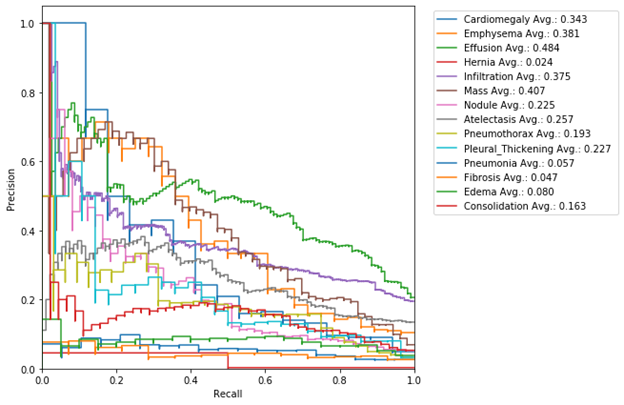

- F1 score is the harmonic mean of the precision and recall, where an F1 score reaches its best value at 1 (perfect precision and recall) and worst at 0. 

- Calibration
  - When performing classification we often want not only to predict the class label, but also obtain a probability of each label. This probability would ideally give us some kind of confidence on the prediction. In order to observe how our model's generated probabilities are aligned with the real probabilities, we can plot what's called a calibration curve.

  - In order to generate a calibration plot, we first bucketize our predictions to a fixed number of separate bins (e.g. 5) between 0 and 1. We then calculate a point for each bin: the x-value for each point is the mean for the probability that our model has assigned to these points and the y-value for each point fraction of true positives in that bin. We then plot these points in a linear plot. A well-calibrated model has a calibration curve that almost aligns with the y=x line.

  - The sklearn library has a utility calibration_curve for generating a calibration plot. Let's use it and take a look at our model's calibration:

    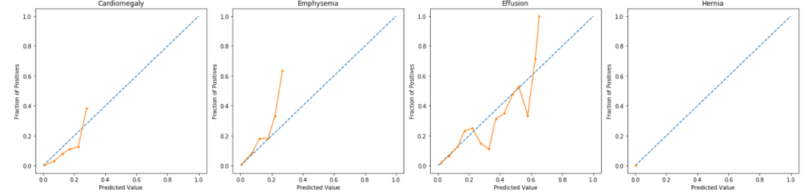

## Assignment 3


***
***

# Labs

## Lab 1.1
- Exploring the [ChestX-ray8 (2017)](https://arxiv.org/abs/1705.02315) dataset.
  - Data types? null?: `df.info()`
  - Unique IDs check: `print(f"The total patient ids are {df.PatientId.count()}, from those the unique ids are {df.PatientId.nunique()} ")`
  - Visualize the random image
    ```python
    # Extract numpy values from Image column in data frame 
    # array(['00008270_015.png',..., '00017951_001.png'], dtype=object)
    images = train_df['Image'].values

    # Extract 9 random images from it
    random_images = [np.random.choice(images) for i in range(9)]

    img_dir = 'nih/images-small/'
    plt.figure(figsize=(20,10))

    # Iterate and plot random images
    for i in range(9):
        plt.subplot(3, 3, i + 1)
        img = plt.imread(os.path.join(img_dir, random_images[i]))
        plt.imshow(img, cmap='gray')
        plt.axis('off')
        
    # Adjust subplot parameters to give specified padding
    plt.tight_layout()   
    ```
  - Image Preprocessing in Keras: Standardize the data using Keras's `ImageDataGenerator` function. Each image will have the mean value of the pixel of 0 and the standard deviation of 1, i.e.  <!-- $z_i = (x_i - \mu) / \sigma$ --> .
    ```python
    # Normalize images
    image_generator = ImageDataGenerator(
        samplewise_center=True, #Set each sample mean to 0.
        samplewise_std_normalization= True # Divide each input by its standard deviation
    )
    ```
    - Before: The dimensions of the image are 1024 pixels width and 1024 pixels height, one single color channel. The maximum pixel value is 1.0000 and the minimum is 0.0000. The mean value of the pixels is 0.4669 and the standard deviation is 0.2492
      -  
    - After: The dimensions of the image are 320 pixels width and 320 pixels height.The maximum pixel value is 2.1455 and the minimum is -1.8822. The mean value of the pixels is -0.0000 and the standard deviation is 1.0000
      - 
    - Comparing the distribution of the pixel before and after standardization:
      - 

## Lab 1.2: Loss function (Binary, Weighted Binary, Weighted Multi-Class problem)
- Demonstration of why using the regular loss function for the imbalance dataset can result in a model that ignore the minority class.
- Implementation of the Weighted Loss Equation:
  - $loss^{(i)} = loss_{pos}^{(i)} + loss_{neg}^{(i)}$
    - $loss_{pos}^{(i)} = -1 \times weight_{pos}^{(i)} \times y^{(i)} \times log(\hat{y}^{(i)})$
    - $loss_{neg}^{(i)} = -1 \times weight_{neg}^{(i)} \times (1- y^{(i)}) \times log(1 - \hat{y}^{(i)})$
  - $loss_{pos}$: the loss where the actual label is positive (the positive examples).
  - $loss_{neg}$: the loss where the actual label is negative (the negative examples).  
- Weighted Loss (Multi-class)


## Lab 1.3: Introduction to Densenet
- Densenet: it is a covnet where each layer is connected to all other layers that are deeper in the network. The first layer is connected to the 2nd, 3rd, 4th etc. The second layer is connected to the 3rd, 4th, 5th etc.    


- Using the pretrained densenet model via Keras:
    ```python
    # Import Densenet from Keras
    from keras.applications.densenet import DenseNet121
    from keras.layers import Dense, GlobalAveragePooling2D
    from keras.models import Model
    from keras import backend as K

    # Create the base pre-trained model
    base_model = DenseNet121(weights='./nih/densenet.hdf5', include_top=False);

    # Define a set of five class labels
    labels = ['Emphysema', 'Hernia', 'Mass', 'Pneumonia', 'Edema']
    n_classes = len(labels)

    # Add a logistic layer with the same size as the number of classes that we're trying to predict
    x = base_model.output
    x_pool = GlobalAveragePooling2D()(x)
    predictions = Dense(n_classes, activation="sigmoid")(x_pool)
    model = Model(inputs=base_model.input, outputs=predictions)
    model.compile(optimizer='adam', loss='categorical_crossentropy')
    ```

## Lab 1.4: Checking if there is Data Leakage
- Objective: Verify that that there is no overlapping of the patient's ID between training set, validation set, and test set. 
    ```python
    # Create a "set" datastructure of the data set id's to identify unique id's
    ids_train_set = set(train_df.PatientId.values)
    ids_valid_set = set(valid_df.PatientId.values)

    # Identify patient overlap by looking at the intersection between the sets
    patient_overlap = list(ids_train_set.intersection(ids_valid_set))
    n_overlap = len(patient_overlap)

    # Get the index of overlapping patient
    train_overlap_idxs = []
    valid_overlap_idxs = []
    for idx in range(n_overlap):
        train_overlap_idxs.extend(train_df.index[train_df['PatientId'] == patient_overlap[idx]].tolist())
        valid_overlap_idxs.extend(valid_df.index[valid_df['PatientId'] == patient_overlap[idx]].tolist())

    # Drop the overlapping rows from the validation set
    valid_df.drop(valid_overlap_idxs, inplace=True)
    ```


## Lab 3.1: Exploring Brain MRI data
- Exploring the Layer of Brain MRI via IPython Widget. Each sample is a 3D volume. It has multiple layers (slice), where each slice is a 2D image. 

  

- Visualize the labels for a specific layer:
  - 0: for normal / 1: for edema / 2: for non-enhancing tumor / 3: for enhancing tumor

  


## Lab 3.2: Extract a sub-section of the data
Training on a full MRI scan would be too memory intensive to be practical, so we need to extract sub-sections of the MRI data to train the network.

- Extract a sub-section of size *patch_length*


## Lab 3.3: Creating a basic U-Net using Keras
- Input layer:
  - num_channels=4 / height=160 / width=160 / length=16
  - 4 sequence of 3D volume


***
***